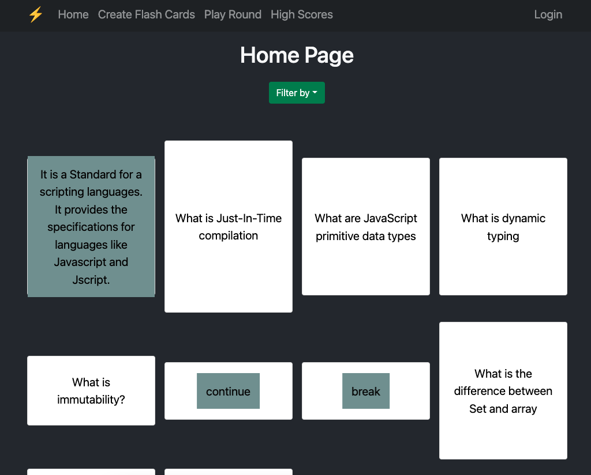
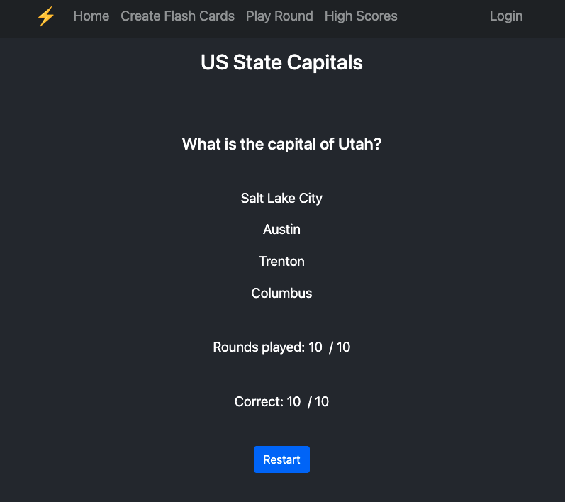

<div align="center">
  
  <h1 align='center'>Flash-Card-Game</h1>
  <p align='center'>
  A Flash Card Game! This project was created for the <a href='https://www.beaverhacks.com/'>OSU Spring Hackathon</a>.

  The team is comprised of <a href='https://github.com/adnjoo'>Andrew</a>, <a href='https://github.com/Stac24'>Stephanie</a>, <a href='https://github.com/calcOSU'>Charles</a>, and <a href='https://github.com/kyleaquino94'>Kyle</a>
  </p>
  <br/>
  <a href="https://flashosu.netlify.app/">Try App</a>
  <br/>
  <br/>
  <br/>

<br/>

</div>
<br/>

## Goal

Our goal was to gamify the learning experience of using flashcards.

We aim to do this by awarding users ⭐&nbsp; STARS for completed games with a satisfactory score
(i.e. 9+/10 score), as well as awarding 💎&nbsp; GEMS for 2 day or more streaks.  

<br/>

## Quickstart

```sh
git clone https://github.com/Stac24/Flash-Card-Game
cd Flash-Card-Game
cd server && npm i --package-lock-only
npm audit fix
```

## env configuration

Create a `.env` in the root folder i.e. `./Flash-Card-Game` and copy contents of `.env.dev` into it.

Don't forget to create another `.env` in the React folder i.e. `./react-ui`
<br/>

## Technologies

* React
* React-Router-Dom
* Express
* PostgreSQL
* Sequelize
* Node
* Cypress

## Build Container and push to gcr

```sh
sudo sysctl -w net.ipv6.conf.all.forwarding=1
docker build -t gcr.io/gcp-gcs-pso/flash-cards .
docker push gcr.io/gcp-gcs-pso/flash-cards
docker history --human --format "{{.CreatedBy}}: {{.Size}}" gcr.io/gcp-gcs-pso/flash-cards
```
